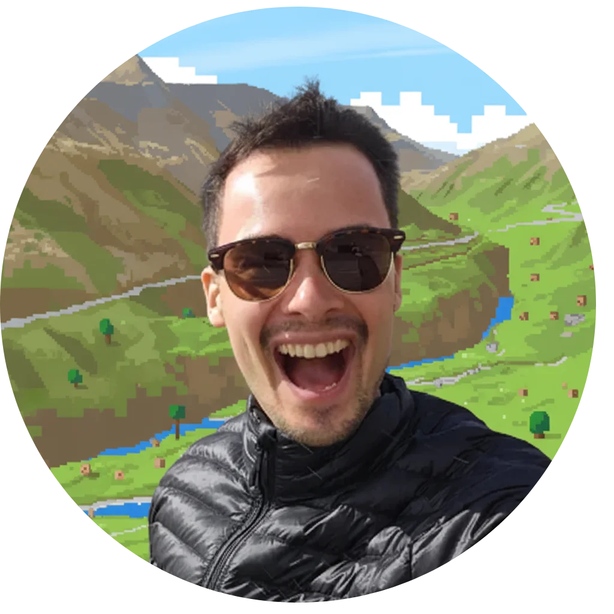

  
# 👋 Hi, I'm Benedikt

### Security Engineer | Hiking Enthusiast | Tinkerer | Geek

Living in Switzerland 🇨🇭

---

## About Me

I'm a security engineer passionate about building secure systems. When I'm not securing infrastructure, you'll find me hiking through the Swiss Alps or tinkering with new technologies.

---

## Connect With Me

  
  
  
  

---

## What I Do

Security Engineering -- 
Tinkering -- 
Mountain Adventures

---

  <i>Feel free to reach out for collaborations or just a friendly chat!</i>

